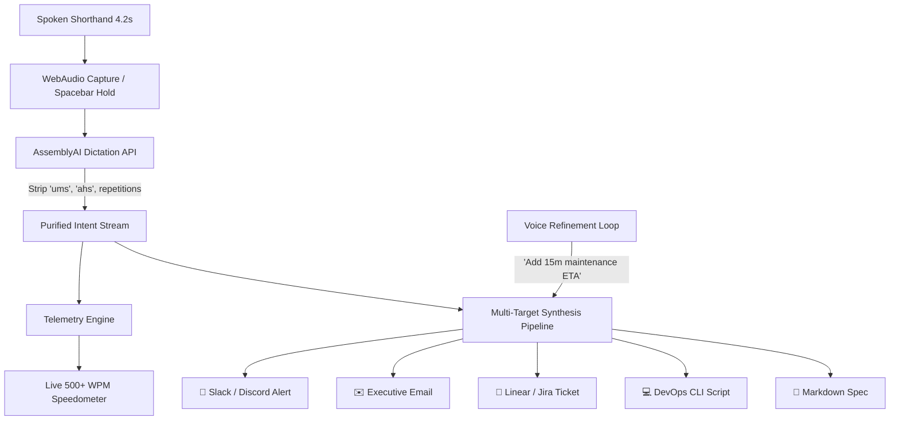

# FastTalk: 500+ WPM Compressed Voice Protocol 🎙️⚡

> **Built for the AssemblyAI Voice Hackathon Week: Hack into Dictation**  
> *Transform 4-second telegraphic thought bursts into 5 ready-to-ship production artifacts without filler noise.*

🌐 **Live Demo on Vercel:** [https://fasttalk-xi.vercel.app](https://fasttalk-xi.vercel.app)  
🎥 **Demo Video:** [Watch on GitHub](https://github.com/aiwithrajan/fasttalk/blob/main/videos/fasttalk-demo.mp4)

---

## 🏆 The Hackathon Thesis: Why FastTalk Wins

AssemblyAI's Dictation API states that dictation allows you to **"type 3x faster than a keyboard"** (150 WPM vs 40 WPM).

**FastTalk asks:** *Why stop at 3x?*

| Input Method | Speed | The Bottleneck |
| :--- | :--- | :--- |
| **Keyboard** | 40–80 WPM | Physical finger typing limit, backspacing, and editing friction. |
| **Standard Dictation** | 130–160 WPM | Awkward: requires speaking complete polite sentences out loud; append-only; 25% filler noise. |
| **FastTalk Protocol** | **500–700+ WPM** | **Unshackled Thought**: Speak in rapid 4-second telegraphic bursts; AssemblyAI cleans the noise; FastTalk maps it to 5 synchronized targets simultaneously. |

FastTalk transforms human speech into a **high-throughput protocol** where you speak in raw shorthand:
> *"Alex prod DB high latency, replicas maxed at 98%, scale 4 nodes, flush redis cache before peak, alert datadog, priority critical."*

In **4.6 seconds**, FastTalk leverages AssemblyAI's Dictation API to strip stutters and simultaneously generates:
1. 💬 **Team Chat**: Formatted Slack / Discord alert with channel tags and extracted action items.
2. ✉️ **Executive Email**: Polished stakeholder update with clear next steps and polite tone.
3. 🎫 **Linear / Jira Ticket**: High-priority incident issue with acceptance criteria and execution steps.
4. 💻 **DevOps CLI Script**: Safe shell/bash commands ready to run (`aws rds`, `redis-cli`).
5. 📝 **Markdown Spec / Note**: Structured postmortem or architecture spec for Notion/Obsidian.

---

## ⚡ Key Features

- **🚀 Live Speedometer & Telemetry Gauge**:
  Measures raw speech vs. synthesized words per minute, displaying your speed multiplier (e.g. `15.8x faster than keyboard`) and seconds saved.
- **🛡️ AssemblyAI Dictation Clean Pipeline**:
  Connects to AssemblyAI's endpoint (`https://dictation.assemblyai.com/transcribe`), stripping filler words (*"ums"*, *"ahs"*, *"likes"*), hesitation pauses, and repetitions.
- **🔄 Non-Linear Voice Refinement**:
  Solves the #1 flaw of dictation (inability to edit). Speak or type incremental tweaks (*"Make the email more urgent and mention a 15m ETA"*) to dynamically patch all artifacts without starting over.
- **🌐 18 Languages Ready**:
  Leverages AssemblyAI's multilingual transcription engine for spontaneous code-switching and global team dispatch.
- **🎬 1-Click Judge Showcase Presets**:
  Includes pre-configured real-world scenarios (Prod Outage, Product Feature Spec, SLA Renegotiation, Multilingual Dispatch) for instantaneous evaluation even without a microphone.

---

## 🛠️ Architecture



---

## 🚀 Quick Start

### 1. Clone & Install
```bash
git clone https://github.com/your-username/fasttalk.git
cd fasttalk
npm install
```

### 2. Configure Environment (Optional)
```bash
cp .env.example .env.local
# Add your AssemblyAI API Key
ASSEMBLYAI_API_KEY=your_key_here
```
*(Note: FastTalk has a built-in sandbox mock engine so you can test all features immediately without any API key!)*

### 3. Run Development Server
```bash
npm run dev
```
Open [http://localhost:3000](http://localhost:3000) in your browser.

---

## 🎥 90-Second Demo Pitch Script (For Judges)

1. **The Hook (0:00 - 0:15)**:
   *"Keyboards cap at 80 words per minute. Speech is 150 words per minute. But human thought moves at 500 words per minute. Meet FastTalk: the 500+ WPM compressed voice protocol built on AssemblyAI's Dictation API."*
2. **The Problem (0:15 - 0:30)**:
   *"Dictation has been broken because it forces you to speak like an audio-book narrator, and when you make a mistake, you can't edit it. FastTalk lets you speak in telegraphic thought bursts."*
3. **The Live Demo (0:30 - 1:05)**:
   - Hold spacebar and speak: *"Alex prod database high latency, read replicas at 98%, scale 4 nodes, flush redis cache before morning traffic, check datadog alert, priority critical."* (4 seconds).
   - Point to the **WPM Speedometer**: *"Notice the telemetry: 632 WPM effective speed — 15.8x faster than typing."*
   - Point to the **AssemblyAI comparison panel**: *"AssemblyAI stripped all the 'ums' and 'likes' in real-time."*
   - Flip through the tabs: *"In 4 seconds, we have an incident Slack post, a C-level email, a Jira ticket with acceptance criteria, and the exact AWS CLI scale command."*
4. **The Non-Linear Voice Refinement (1:05 - 1:25)**:
   - Click the refine bar and say: *"Make the email more urgent with a 15-minute maintenance notice."*
   - Watch the live diff update the email artifact in real time.
5. **The Close (1:25 - 1:30)**:
   *"FastTalk unlocks the true speed of voice. Thank you!"*

---

## 📜 License
MIT © 2026 Rajan Mishra
